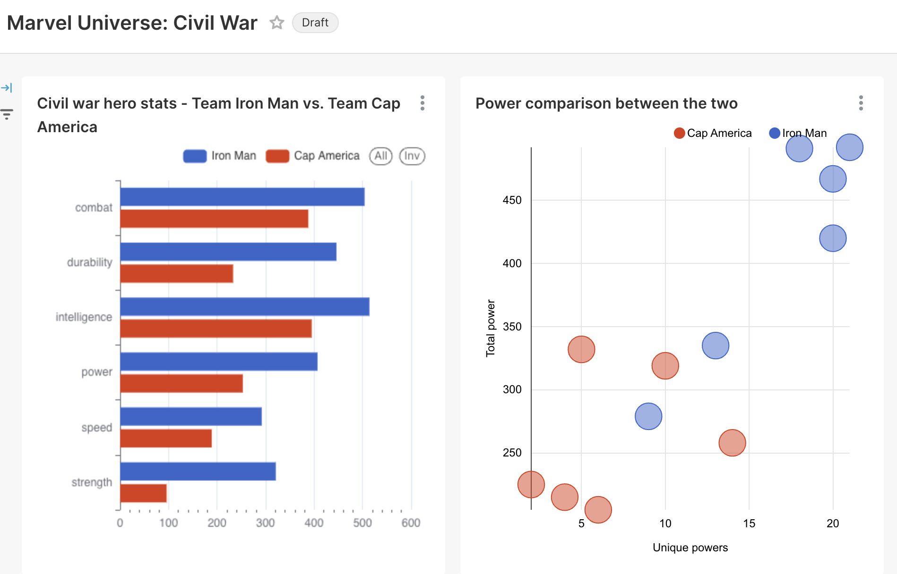
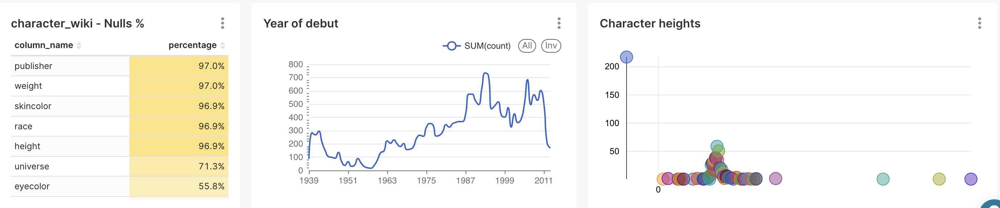

# Superhero ETL Pipeline

## 1. Instruction to use

Pre-requisites:
Docker

STEP 1:
spin up the database <br>

```bash
$ docker-compose up -d >> logs/etl.log 2>&1
```

STEP 2:
run migrations<br>

```bash
$ alembic upgrade heads >> logs/etl.log 2>&1
```

STEP 3:
pass unit tests<br>

```bash
$ python -m unittest tests.test_extract
$ python -m unittest tests.test_transform
$ python -m unittest tests.test_load
```

STEP 4:
ready to ingest data<br>

```bash
$ python app.py
```

## 2. Sample use case

<br>
Live dashboard link (private invitation only):
https://8468b23a.eu5a.app.preset.io/superset/dashboard/p/xlO9pgzemow/

## 3. Data quality check and monitoring system


Live dashboard link (private invitation only):
https://8468b23a.eu5a.app.preset.io/superset/dashboard/p/xlO9pgzemow/

## 4. Future improvement points

- [ ] To handle connection error when loading data into the database, develop reconnect and retry logic with resume token to
- [ ] To fasten loading data, develop partitioning to load data in batches
